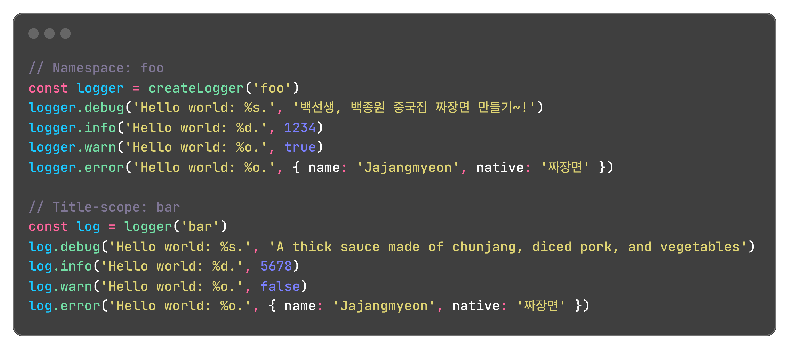
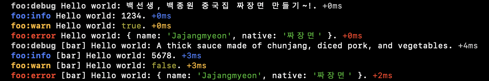

<h1 align="center">Welcome to logger 👋</h1>






---

A [debug.js](https://github.com/debug-js/debug#readme)-based logging utility:

* Predefined log types (`debug`, `info`, `warn`, `error`);
* Use **namespace** to distinguish your app logs from other outputs in browser Consoles or Terminals;
* Enable one or more types or a log level as you need;
* **Title-scoped** logs to further title your logs across app modules.

## Install

```bash
npm install @gloxy/logger
# or
yarn add @gloxy/logger
# or
pnpm add @gloxy/logger
```

## Usage

### Create and logging

The only parameter `namespace` (e.g., 'myapp') helps distinguish these logs from other prints on Browser DevTool Consoles or Terminals.

```javascript
import { createLogger } from '@gloxy/logger'
const logger = createLogger('myapp')
```

Logger includes 4 types of logging: `debug`, `info`, `warn`, and `error`, which use the respective `console` methods under the hood of the browsers and Node.js.

```javascript
logger.info('Ball player %s is performing well', 'Mary')
// myapp:info Ball player Mary is performing well +0ms
```

### Title Scoped Logger

You can create title-scoped logger `logger(<title>)`, especially useful for module files.

```javascript
/* ./logger.js  */

import { createLogger } from '@gloxy/logger'
export const logger = createLogger('myapp')
```

```javascript
/* ./foo.js */

import { logger } from './logger'

const log = logger('foo')
log.info('Ball player %s is performing well', 'Mary')
// myapp:info [foo] Ball player Mary is performing well +0ms
```

```javascript
/* ./bar.js */

import { logger } from './logger'

const log = logger('bar')
log.info('Ball player %s is performing well', 'Mary')
// myapp:info [bar] Ball player Mary is performing well +0ms
```

### Enabling and Disabling

Logger is disabled by default. You can enable all log types (`*`) or one of them(`debug`, `info`, `warn`, and `error`) by setting name (**namespace:type**), or multiple types (separated with commas, **namespace:type1,namespace:type2**). Refer to [debug.js](https://github.com/debug-js/debug/tree/master?tab=readme-ov-file#wildcards).

#### Platforms

- To enable the logger:

  * In web browsers: `localStorage.logger = 'myapp:*'`
  * In Node.js: set the environment variable `LOGGER=myapp:*`

  Specify a type to enable the single type of logger, e.g, `myapp:error`.

- Disable logger by removing these settings.

#### Programmatically

```javascript
import { disable, enable } from '@gloxy/logger'

enable('myapp:*')
disable()
```

#### Enable by levels

Logger supports 4 levels. You can enable multiple log types by enabling a level (**namespace:level**).

- 1: `error`
- 2: `error, warn`
- 3: `error, warn, info`
- 4: `error, warn, info, debug`

For example, enable level 2 to output only critical error and warning logs in producation.

```javascript
if (import.meta.env.NODE_ENV === 'producation') {
  enable('myapp:2')
}
```

## Author

👤 **GloryWong**

* Website: https://glorywong.com
* GitHub: [@GloryWong](https://github.com/GloryWong)

## Show Your Support

Give a ⭐️ if this project helped you!
